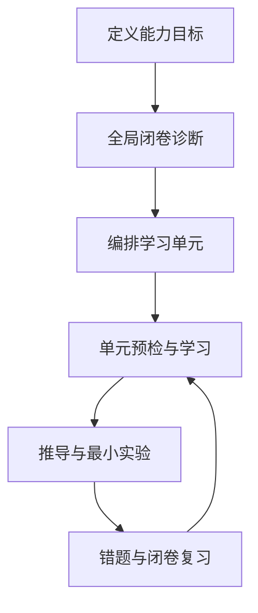

# ChatGPT 辅助定位建图系统学习与工程实践

`localization-mapping-learning` 是一个公开的单体学习仓库，用于持续记录我用 ChatGPT 实践“十倍学习法”学习定位、建图与状态估计的全过程。

它不是一份一次性整理好的知识大全，而是一套可追踪、可运行、可复习的学习系统：问题、原始回答、纠错、推导、代码实验、测试和复盘都放在同一个仓库中，用输出证据检验自己是否真正掌握。

## 从这里开始

根据目的选择一条路径，不必从头浏览所有目录：

1. **查看作者学习记录**：从[第一次全局诊断报告](docs/00_learning_system/diagnostic_report.md)、[学习地图](docs/00_learning_system/learning_map.md)和[进度表](docs/00_learning_system/progress.md)了解诊断如何转化为学习路线。这些是作者的参考产物，不代表阅读者已经掌握。
2. **跟随仓库学习定位建图**：先打开[单元目录](docs/units/README.md)，再进入当前的[单元 01：坐标系与变换链](docs/units/01_coordinate_frames/README.md)，按[两小时单元执行说明](docs/00_learning_system/unit_workflow_2h.md)留下自己的闭卷回答、推导、实验结果和错题。
3. **复用方法学习一个新领域**：从[新领域启动手册](docs/00_learning_system/new_domain_bootstrap.md)开始，先定义能力目标并完成全局诊断，再生成自己的学习地图和两小时单元。

## 当前唯一下一步

面向现在要从零学习单元 01 的读者，当前唯一下一步是：打开[学习工作簿](docs/units/01_coordinate_frames/workbook.md)，先完成“阶段 0：任务契约”。在写下本次目标、约定和预期产物前，不先读参考推导，也不直接运行现成实验。

下表记录的是仓库作者进度。第一次跟随仓库学习的读者不要直接继承其中的勾选状态；请从工作簿阶段 0 开始，再完成单元 01 的闭卷预检，建立属于自己的证据。

## 当前进度

当前状态：**v0.1 仓库基线与第一次全局诊断已完成；v0.2 的单元 01 材料已经就绪，学习者个人证据尚未开始。**

| 单元 | 主题 | 预计用时 | 状态 | 主要产出 |
|---:|---|---:|---|---|
| 0 | [基础诊断与能力画像](docs/00_learning_system/diagnostic_report.md) | — | 已完成 | [完整诊断复盘](articles/00_diagnostic_review.md) · [社交平台精简版](articles/00_diagnostic_review_social.md) |
| 1 | [坐标系与变换链](docs/units/01_coordinate_frames/README.md) | 2 h | 材料就绪，待学习 | 笔记、推导、测验、变换实验 |
| 2 | 旋转与刚体位姿 | 2 h | 待开始 | 旋转表示与数值实验 |
| 3 | 传感器、时间与标定 | 2 h | 待开始 | 时间线、外参和运动补偿实验 |
| 4 | 最小二乘基础 | 2 h | 待开始 | 投影、秩与加权最小二乘实验 |
| 5 | 概率与卡尔曼更新 | 2 h | 待开始 | 一维融合与协方差实验 |
| 6 | IMU 与轮式推算 | 2 h | 待开始 | 比力、重力、零偏和积分实验 |
| 7 | 局部里程计 | 2 h | 待开始 | 多种里程计对比 |
| 8 | 滤波与因子图 | 2 h | 待开始 | 递推估计与批量优化对比 |
| 9 | SLAM 与全局修正 | 2 h | 待开始 | 回环、图优化与 TF 分析 |
| 10 | 重定位与综合设计 | 2 h | 待开始 | 场景方案设计与评审 |

全部单元入口见[单元目录](docs/units/README.md)，详细状态见[学习进度表](docs/00_learning_system/progress.md)，阶段目标见 [ROADMAP](ROADMAP.md)。

## 我希望练成的五种能力

1. 能画清传感器、坐标系、时间和数据流；
2. 能解释主要算法解决的问题、输入、输出和假设；
3. 能读懂并使用关键公式，说明变量、单位和坐标系；
4. 能运行参考代码、观察中间结果并分析失败原因；
5. 能根据传感器、场景、算力和精度要求选择方案。

每个学习单元都尽量形成同一组证据：核心问题、笔记、手工推导、最小代码实验、失败案例、闭卷测验、错题记录和一页速查表。

仓库中的笔记、答案和运行结果是可参考的样例；真正的学习者证据必须由学习者独立产生，至少包括原始回答、手工推导、亲自运行的结果解释、真实错题和按日期完成的复习记录。

## 两小时单元怎样执行

每个两小时单元统一执行阶段 0～7：任务契约（定向）、单元预检、针对性学习、独立练习或推导、最小实践、条件变化或故障注入、后测与费曼输出、归档与复习。完整的时间分配、输入输出和停止条件见[两小时单元执行说明](docs/00_learning_system/unit_workflow_2h.md)。

全局诊断与单元预检用途不同：全局诊断只在启动或阶段复盘时评估整个领域、决定学习顺序；单元预检在每个两小时单元开始时进行，只用于暴露该主题的当前缺口。两者都不能用仓库中的参考答案替代自己的第一反应。

## 仓库结构

```text
localization-mapping-learning/
├── docs/                 # 学习系统、单元笔记、测验和错题
├── articles/             # 可独立发布的阶段复盘文章
├── src/                  # 可复用的最小算法实现
├── experiments/          # 按问题组织的可运行实验
├── tests/                # 对数学约定和代码行为的自动验证
├── data/                 # 仅存放小型合成或公开样例
├── references/           # 资料、开源仓库和术语索引
└── .github/              # Issue/PR 模板和持续集成
```

初始版本只建立正在使用的目录。新的单元、ROS 工作区和大型实验会在真正开始时加入，避免提前堆积空目录。

## 快速开始

需要 Python 3.10 或更高版本。

```bash
python -m venv .venv
source .venv/bin/activate
python -m pip install -e ".[dev]"
pytest
python experiments/exp_001_transform_chain/run.py
```

也可以使用：

```bash
make install
make check
make experiment
```

第一个实验验证三个关键事实：变换链的相邻坐标系必须衔接，复合变换与逐步变换结果一致，刚体变换的逆不能直接写成齐次矩阵的转置。

## 默认数学约定

除非单个实验另行声明，本仓库采用：

- 右—前—上坐标轴；
- 右手系；
- 列向量与左乘。

坐标变换统一使用目标坐标系作为左上标、源坐标系作为右下标。核心映射关系为：

$$
{}^{A}\mathbf p = {}^{A}\mathbf T_B{}^{B}\mathbf p
$$

它表示把点在坐标系 $B$ 中的坐标映射为该点在坐标系 $A$ 中的坐标。

齐次变换定义如下：

$$
\mathbf T =
\begin{bmatrix}
\mathbf R & \mathbf t \\
\mathbf 0^{\mathsf T} & 1
\end{bmatrix}
$$

完整约定见 [conventions.md](docs/00_learning_system/conventions.md)。

## 学习闭环



全局诊断阶段限制题目数量，教学阶段才展开追问；即时答对不算掌握，还要通过第 1、3、7、14 天复习和代码实验再次验证。完整学习顺序见[学习地图](docs/00_learning_system/learning_map.md)。

## 数据与公开边界

这是公开仓库。只提交自编、合成、允许再分发或明确注明来源的公开材料。以下内容不得进入仓库：

- 公司代码、内部文档、配置和算法细节；
- 真实项目日志、地图、标定结果和传感器数据；
- 密钥、账号、车辆标识、位置或其他敏感信息；
- 来源和授权不明确的大文件。

大型公开数据集只记录下载地址、校验方式和处理脚本，不直接提交原始数据。详见 [data/README.md](data/README.md)。

## 文档排版与校验

所有新增或修改的 Markdown 都必须遵守 [贡献指南](CONTRIBUTING.md) 中的仓库级
排版与渲染规范，并运行 `make markdown`。自动检查负责发现未配对的公式、强调、
代码围栏、失效的相对链接和图片等问题；发布前仍需在 GitHub Preview 与 Typora
中实际查看，面向知乎或 X 的文章还应检查手机端显示。

## 参与和许可

欢迎通过 Issue 指出概念错误、实验缺陷或资料建议，提交前请阅读 [CONTRIBUTING.md](CONTRIBUTING.md)。

- 源代码使用 [MIT License](LICENSE)；
- 文档、文章和图示使用 [CC BY 4.0](LICENSE-DOCS)。

如果你也在用 AI 学习定位建图，可以复用这里的组织方式和实验，但请保留必要署名，并用自己的闭卷回答和实验结果替换我的结论。
