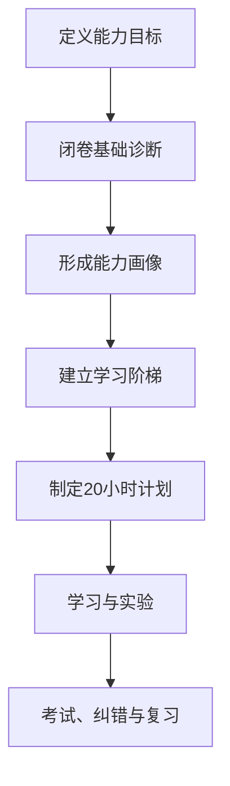

# 我用 ChatGPT 实践“十倍学习法”学习定位建图：第一次诊断复盘

> 这不是一篇定位建图知识大全，而是一次真实的学习实验：我尝试把《如何用 Claude 以 10 倍速度学会任何东西》中的方法迁移到 ChatGPT，用它诊断自己的定位建图基础，并据此设计后续学习路线。

## 一、为什么我要改变使用 AI 学习的方式

我是自动驾驶感知算法工程师，熟悉深度学习、多传感器数据和感知工程，也接触过 BEV、时间同步、机器人定位和重定位等问题。但当我准备系统学习定位建图时，我发现自己的知识存在一个明显问题：**知道不少术语，也能理解部分系统框架，却没有形成稳定、完整的知识体系。**

过去我使用 AI 学习时，常采用下面这种方式：

1. 遇到一个问题；
2. 让 AI 解释；
3. 阅读一篇看起来很完整的回答；
4. 当时觉得自己理解了；
5. 过一段时间，再遇到相似问题时仍然困惑。

这种方式适合快速查资料，却不一定能真正完成学习。阅读答案时产生的“熟悉感”，很容易被误认为掌握。只有合上资料以后自己解释、计算、推导和判断，理解上的漏洞才会暴露出来。

我读到《如何用 Claude 以 10 倍速度学会任何东西》后，决定不再只让 AI 给我讲答案，而是让它同时承担教师、考官、学习规划者和反馈工具的角色。原文使用的是 Claude，我把这套方法迁移到了 ChatGPT，并选择“自动驾驶定位建图”作为实践主题。

需要先说明：**“十倍学习法”是原文章的说法，我目前并没有证据证明自己的学习速度真的提高了十倍。**这篇文章记录的是第一次基础诊断，以及我对这套方法的初步验证和改造。是否真正有效，还要由后续的延迟复习、代码实验和真实项目应用来证明。

## 二、原方法解决了 AI 学习中的哪些问题

原文给出了六类提示词。它们并不是六个互不相关的小技巧，而是在补齐真实学习所需的不同环节。

| 方法 | 要解决的问题 | 我在定位建图学习中的用法 |
|---|---|---|
| 五级学习阶梯 | 不知道先学什么、后学什么 | 建立从系统语言到工程实践的能力层级 |
| 20 小时计划 | 学习范围太大，容易失去重点 | 筛选第一轮最值得掌握的核心知识 |
| 严格考试 | 看懂了，却不知道自己是否真的会 | 用主动回忆暴露知识边界 |
| 一页速查表 | 学完后难以快速复习 | 压缩符号、公式、概念和常见错误 |
| 筛选核心资源 | 花太多时间收集资料 | 只保留教材、官方文档、代码和数据集中的核心资料 |
| 费曼循环 | 能看懂，却不能用自己的话讲明白 | 反复复述、纠错，直到解释准确完整 |

原文将它概括为“路径—测试—压缩—重复”。我认为这个方向是对的，但定位建图是一个交叉领域，直接照搬六个提示词还不够。

定位建图同时涉及坐标几何、线性代数、概率估计、传感器、时间同步、滤波、优化、里程计、SLAM、重定位和 ROS 工程。更重要的是，我对这些内容的掌握并不均衡。如果直接让 ChatGPT 制定一份统一的新手计划，它很可能重复讲我已经理解的内容，也可能在我基础不足的地方推进过快。

因此，我对原方法做了第一个调整：



也就是：**先诊断，再规划，而不是一开始就让 AI 系统授课。**

## 三、我如何定义“学会定位建图”

“帮我系统学习定位建图”是一个过大的目标，很难判断什么时候算完成。为了让学习结果可以验证，我把它改成了五种具体能力：

1. 能画清定位建图系统的传感器、坐标系、时间和数据流；
2. 能解释主要算法解决什么问题，输入和输出是什么；
3. 能读懂关键公式，说明变量、坐标系、单位、假设和误差来源；
4. 能运行一个参考系统，观察中间结果并分析失败原因；
5. 能根据传感器、场景、算力和精度要求选择方案。

这个改动很重要。学习目标不再是“看完多少章节”或者“记住多少术语”，而是最终能够提供什么证据。

随后，我给 ChatGPT 设置了三个角色：

- 定位建图学习教练；
- 严格考官；
- 工程评审。

我要求它先依次检查九个模块：坐标变换、线性代数、概率估计、传感器、ROS 与系统工程、滤波与优化、里程计、SLAM 和重定位；一次只问一个问题，在我回答前不能给答案。每次回答后，它需要评分，指出我答对了什么、漏掉了什么，并且只重新讲解错误部分。

我还明确要求：诊断结束以前，不开始正式教学，也不提前制定完整学习计划。

## 四、第一次诊断怎样暴露了我的真实问题

这次诊断最有价值的地方，不是 ChatGPT 给出了多少知识，而是它让我看到：有些内容我以为自己会，其实只会写结论；有些内容我觉得自己薄弱，实际已经具备较好的系统认识。

下面选择五组最有代表性的过程。

### 1. 我会连接坐标链，却不真正理解刚体变换

第一题给出：

$$
{}^{\mathrm{map}}\mathbf{T}_{\mathrm{odom}}, \qquad
{}^{\mathrm{odom}}\mathbf{T}_{\mathrm{base}}
$$

要求把一个在 $\mathrm{base}$ 坐标系中表示的点变换到 $\mathrm{map}$ 坐标系。我正确写出了：

$$
{}^{\mathrm{map}}\mathbf{p}
=
{}^{\mathrm{map}}\mathbf{T}_{\mathrm{odom}}
{}^{\mathrm{odom}}\mathbf{T}_{\mathrm{base}}
{}^{\mathrm{base}}\mathbf{p}
$$

我的解释是，相邻上下标可以像分子、分母一样“消掉”，但我无法从数学上解释为什么变换采用左乘。

ChatGPT 指出，“消掉”只是一种检查坐标链是否连续的记忆方法，真正的依据是前一个变换的输出坐标系必须与后一个变换的输入坐标系衔接。当前使用左乘，是因为采用了列向量约定；如果使用行向量，表示方式和顺序也会随之改变。

随后，我在求逆时犯了更关键的错误：我把完整齐次变换矩阵的逆写成了转置。我混淆了旋转矩阵和刚体变换矩阵：

$$
\mathbf{R}^{-1}=\mathbf{R}^{\mathsf{T}}
$$

只对旋转矩阵成立。对于：

$$
\mathbf{T}=
\begin{bmatrix}
\mathbf{R} & \mathbf{t}\\
\mathbf{0}^{\mathsf{T}} & 1
\end{bmatrix}
$$

其逆为：

$$
\mathbf{T}^{-1}=
\begin{bmatrix}
\mathbf{R}^{\mathsf{T}} & -\mathbf{R}^{\mathsf{T}}\mathbf{t}\\
\mathbf{0}^{\mathsf{T}} & 1
\end{bmatrix}
$$

这组问题让我意识到：**能够熟练写出常见坐标链，不代表已经理解变换约定、复合和求逆。**如果我只是让 ChatGPT 从头讲一遍坐标变换，很可能会因为前半部分“看得懂”，而错过这个真正的漏洞。

### 2. 我会做基本矩阵运算，却不熟悉最小二乘

线性代数诊断给出了一个三行两列的矩阵，要求求解：

$$
\hat{\mathbf{x}}
=
\underset{\mathbf{x}}{\operatorname{arg\,min}}\;
\lVert\mathbf{A}\mathbf{x}-\mathbf{b}\rVert_2^2
$$

我首先问：“什么是正规方程？”这直接说明我对最小二乘的基础不熟悉。随后又出现了几类不同错误：

- 不知道求梯度时为什么会出现 $\mathbf{A}^{\mathsf{T}}$；
- 求解过程中算出了逆矩阵，却漏乘右侧向量；
- 知道可以用行列式判断可逆性，却把“行列式非零”错误地说成“不可逆”；
- 一开始不能准确解释残差的几何意义。

经过计算，最终得到：

$$
\hat{\mathbf{x}}
=
\begin{bmatrix}
\frac{2}{3}\\[1mm]
\frac{5}{3}
\end{bmatrix},
\qquad
\mathbf{r}
=
\begin{bmatrix}
\frac{1}{3}\\[1mm]
\frac{1}{3}\\[1mm]
-\frac{1}{3}
\end{bmatrix}
$$

并验证：

$$
\mathbf{A}^{\mathsf{T}}\mathbf{r}=\mathbf{0}
$$

这表示残差与 $\mathbf{A}$ 的列空间正交，而 $\mathbf{A}\hat{\mathbf{x}}$ 是 $\mathbf{b}$ 在该列空间上的正交投影。

这次过程使我看到，所谓“线性代数基础”至少包含三个层次：能完成计算、能解释公式来源、能理解几何意义。只完成第一层，面对点云匹配、重投影误差、加权最小二乘或系统退化时仍然会遇到困难。

### 3. 我混淆了随机变量相加与贝叶斯融合

概率估计题给出一维位置先验：

$$
x\sim\mathcal{N}(10, 4)
$$

题目没有指定物理单位，因此这里把 $x$ 和后面的 $z$ 视为使用同一抽象长度单位；正态分布的第二个参数 $4$ 表示方差，单位是该抽象长度单位的平方。

传感器测量为 $z=12$，测量噪声方差为 $1$。ChatGPT 先不让我计算，只问融合结果更接近 10 还是 12。

我的回答是更接近 10，因为“正态分布相加后的均值是均值相加”。这个答案暴露了一个本质混淆：

- $Z=X+V$ 是随机变量相加；
- $p(x\mid z=12)$ 是获得测量后的条件估计。

本题属于后者。由于测量方差 $1$ 小于先验方差 $4$，测量更可靠，融合结果应该更接近 12。

按照方差倒数分配信息权重后，先验和测量的归一化权重分别为：

$$
w_{\mathrm{prior}}=\frac{1}{5},
\qquad
w_{\mathrm{measurement}}=\frac{4}{5}
$$

因此后验均值与方差为：

$$
\hat{x}=\frac{1}{5}\times 10+\frac{4}{5}\times 12=11.6
$$

$$
\sigma_{\mathrm{post}}^2
=
\left(\frac{1}{4}+1\right)^{-1}
=0.8
$$

后来再把测量方差增大到 $100$，我已经能够判断融合结果会接近先验值 10，融合方差会接近但略小于 4。继续转换到卡尔曼更新形式时，我也算出了增益 $K=0.8$，并理解了创新表示测量与预测测量之间的差异。

这一组问题说明：**主动考试不仅能发现“不会”，还可以定位错误知识模型究竟错在哪里。**如果只是计算后验均值，我可能算对；先问方向和原因，才暴露出我混淆了两个概率问题。

### 4. 我曾把 IMU 的估计结果当成直接测量量

传感器题问 IMU 和轮速计直接测量什么。我最初回答，IMU 测量车辆的姿态，包括 $x$、$y$ 和航向角；轮速计测量车轮转速。

这里包含两个问题：$x$、$y$ 是位置，不是姿态；更重要的是，IMU 并不直接测量位置和姿态。它通常直接测量：

- 陀螺仪：三轴角速度；
- 加速度计：三轴比力。

位置需要经过一条完整的估计链路得到：

$$
\text{角速度}
\rightarrow
\text{姿态}
\rightarrow
\text{坐标变换与重力处理}
\rightarrow
\text{世界系加速度}
\rightarrow
\text{速度}
\rightarrow
\text{位置}
$$

后续追问又让我进一步理解了几个容易混淆的问题：

- 静止时加速度计仍会测得大小约为 $g$ 的比力，根本原因不是零偏；
- 姿态估计误差会造成重力投影错误，产生虚假水平加速度；
- 虚假加速度再经过积分，会形成速度和位置漂移；
- 匀速转弯虽然速度大小不变，但速度方向变化，因此仍有向心加速度；
- 在“右—前—上”坐标系中，右转角速度沿负 $z$ 轴，向心加速度沿正 $x$ 轴；
- 向心加速度与乘客感受到的虚拟离心力不能混为一谈。

这部分是整个诊断中追问最多的模块。它确实暴露了不少问题，但也引出了这套学习方法在执行上的一个缺陷：诊断逐渐变成了正式教学，题目数量和时间开始失控。这个问题后面还会专门讨论。

### 5. 我的系统理解明显强于数学与传感器基础

在 ROS、滤波、里程计、SLAM 和重定位部分，我的回答整体更好：

- 知道多传感器融合应依据采样时间戳，而不是消息到达时间；
- 知道滤波器会根据预测与测量的不确定性分配权重；
- 理解里程计为什么短期连续而长期漂移；
- 理解 SLAM 前端、后端、回环和图优化的基本关系；
- 能区分回环检测与重定位；
- 知道全局修正通常不直接破坏 ${}^{\mathrm{odom}}\mathbf{T}_{\mathrm{base}}$ 的连续性，而是调整 ${}^{\mathrm{map}}\mathbf{T}_{\mathrm{odom}}$。

但综合题仍然暴露了一些不完整之处：

- 只说查询激光雷达参考时刻的 TF，没有考虑其他传感器各自的采样时刻和点云帧内运动补偿；
- 误以为图优化只使用历史数据，没有预测和测量；
- 解释保持里程计连续性时，只想到车辆控制，没有覆盖局部规划和运动补偿；
- 重定位输入只写了已有地图，遗漏了当前传感器观测。

这说明诊断的另一个价值是：**它可以避免让我从头重复学习已经比较熟悉的内容，把时间集中到真正薄弱的环节。**

## 五、诊断后，我获得了怎样的能力画像

九个模块的结果如下。分数来自对话过程中的即时评价，只用于比较相对强弱，并不是标准化考试成绩。

| 模块 | 得分 | 主要结论 |
|---|---:|---|
| 坐标变换 | 7/10 | 会连接坐标链，但变换约定与求逆不牢固 |
| 线性代数 | 5/10 | 基本计算尚可，最小二乘与秩的概念较弱 |
| 概率估计 | 6/10 | 能理解权重，条件估计和贝叶斯更新不熟悉 |
| 传感器基础 | 6/10 | 知道积分漂移，IMU 比力与重力模型薄弱 |
| ROS 与系统工程 | 7/10 | 理解采样时间，异频对齐和运动补偿需加强 |
| 滤波与优化 | 6/10 | 理解不确定性融合，滤波与图优化区分不清 |
| 里程计 | 8/10 | 输入输出、连续性和漂移理解较好 |
| SLAM | 8/10 | 前后端、回环和图约束基本清楚 |
| 重定位 | 9/10 | 与回环的区别及全局坐标修正理解较好 |

诊断以前，我对自己的评价只是“定位建图基础薄弱”。诊断以后，这个判断变得更具体：

> 我的系统架构和模块关系理解较好，但数学估计基础、IMU 物理模型、滤波优化和部分时间处理细节不够扎实。

这种精确画像比一个笼统的“基础薄弱”更有价值，因为它直接决定后面的学习时间应该怎样分配。

## 六、这次实践也暴露了 AI 学习法本身的问题

第一次实践并不完全顺利，其中最明显的问题是题目失控。

原计划是依次诊断九个模块，但在 IMU 部分，ChatGPT 根据每一次回答不断追问：静止时输出什么、匀速直线时输出什么、加速时输出什么、转弯时输出什么、角速度符号是什么、乘客为什么感觉被甩向外侧……这些问题有助于理解，却使“诊断”逐渐变成了“教学”。

当我感觉题目已经明显超过原计划后，主动询问还剩多少题。随后我们把剩余规则调整为：**每个模块只问一道综合题，不再连续追问。**

这个过程给了我几条重要提醒。

### 1. AI 不会天然控制好学习节奏

“一次只问一题”可以保证互动，却不等于总题数可控。以后需要在提示词中进一步约定：

- 每个模块最多一道主问题和一道追问；
- 追问只用于判断能力，不在诊断阶段展开完整教学；
- 到达时间上限后先记录问题，正式学习时再处理。

### 2. 即时评分只能作为相对参考

ChatGPT 给出的 7 分或 8 分带有主观性。它适合标记优势和短板，却不能证明我已经达到某种绝对水平。更可靠的评分需要统一维度，例如：核心结论、推理过程、公式与单位、工程联系。

### 3. 当场听懂不等于长期掌握

ChatGPT 纠正以后，我能理解正确答案，但这只能证明“此刻看懂了”，不能证明几天后还能闭卷解释，更不能证明能在代码和日志中使用。

因此，后续学习必须增加三类证据：

- 第 1、3、7、14 天的延迟测试；
- 手算、推导和最小代码实验；
- 在公开数据或真实项目中的故障分析。

### 4. AI 不能成为唯一事实来源

涉及公式、坐标约定、ROS 行为和算法结论时，还需要教材、官方文档、论文、代码和实验结果作为依据。ChatGPT 更适合组织学习、生成问题和提供反馈，而不是替代原始资料。

## 七、我对“十倍学习法”做出的第二轮改造

经过第一次诊断，我把原来的六类提示词进一步组合成下面这套流程：

$$
\boxed{
\begin{gathered}
\text{目标}
\rightarrow
\text{诊断}
\rightarrow
\text{能力画像}
\rightarrow
\text{学习阶梯}
\rightarrow
\text{核心资源}\\
\rightarrow
\text{20小时第一轮}
\rightarrow
\text{考试与费曼纠错}
\rightarrow
\text{速查表}\\
\rightarrow
\text{间隔复习}
\rightarrow
\text{项目验证}
\end{gathered}
}
$$

我还会把诊断模式和教学模式明确分开。

| 诊断模式 | 教学模式 |
|---|---|
| 不提前提示 | 针对错误进行讲解 |
| 限制问题与追问数量 | 可以递进追问 |
| 记录第一反应和原始能力 | 配合推导、例子和实验 |
| 不在现场补完所有知识 | 达到过关标准后再进入下一主题 |

错题日志也不能只记录“这道题错了”，而要标记错误类型：概念错误、推理错误、计算错误、符号错误、坐标或时间错误、工程边界遗漏。只有知道错误为什么发生，复习才有针对性。

## 八、诊断之后形成的 20 小时学习路线

这 20 小时不是为了学完定位建图，而是完成第一轮核心知识建设：形成全局框架，掌握最关键的数学与系统关系，完成若干最小实验，并判断后续深入方向。

| 单元 | 主题 | 主要任务 |
|---|---|---|
| 1 | 坐标系与坐标链 | 统一符号，掌握复合、求逆和变换方向 |
| 2 | 旋转与刚体位姿 | 理解旋转矩阵、欧拉角、四元数和齐次变换 |
| 3 | 传感器、时间与标定 | 建立测量量、时间戳、外参和运动补偿关系 |
| 4 | 最小二乘基础 | 掌握残差、雅可比、秩、投影和加权最小二乘 |
| 5 | 概率与卡尔曼更新 | 理解条件估计、创新、增益和协方差更新 |
| 6 | IMU 与轮式推算 | 理解比力、重力、零偏、积分和轮胎打滑 |
| 7 | 局部里程计 | 对比轮式、视觉、激光和视觉惯性里程计 |
| 8 | 滤波与因子图 | 区分递推滤波、滑窗优化和全局平滑 |
| 9 | SLAM 与全局修正 | 理解前后端、回环、图优化和 TF 变化 |
| 10 | 重定位与综合设计 | 面向草地和狭窄通道完成方案设计与评审 |

每个单元必须包含一个明确问题、一组核心公式、一个手算或最小代码实验、一个真实故障场景、一次闭卷考核和一张知识卡片。前六个单元集中补齐这次诊断发现的短板，后四个单元利用我已有的系统工程认识建立完整闭环。

## 九、其他人如何复用这套方法

如果你也想用 ChatGPT 学习一个复杂主题，不建议直接复制我的定位建图题目。更值得复制的是流程。

### 第一步：把“学习某个主题”改成可验证能力

不要只写“我要系统学习 SLAM”或者“我要学会经济学”。先回答：学完以后，你应该能够解释什么、计算什么、实现什么、判断什么？

### 第二步：让 AI 先诊断，不要立刻授课

告诉它你的背景和目标，让它覆盖必要的前置知识，一次只问一题。回答时尽量不查资料，并保留自己的原始答案，包括错误。

### 第三步：限制诊断范围和追问数量

明确规定每个模块的问题上限、总时长和停止条件，避免诊断变成无限教学。

### 第四步：根据错误重新安排学习顺序

不要平均学习所有模块。已经掌握的部分用综合题验证即可，把时间用于最影响后续理解的短板。

### 第五步：要求提供掌握证据

每个主题至少检查：

- 能否脱离资料用自己的话解释；
- 能否写出核心公式并解释变量、单位和假设；
- 能否完成一个计算、推导或最小实验；
- 能否判断一个错误结果可能由什么造成；
- 能否说明它在整个系统中的位置。

### 第六步：用延迟测试和项目验证结果

当天答对不算结束。几天后重新闭卷测试，并把知识用于代码、数据和真实问题。只有错误不再复发，才说明它开始成为稳定能力。

## 十、这次实践给我的最终结论

第一次诊断并没有让我“学会定位建图”，但它完成了一件非常重要的事：把我模糊的自我判断，变成了一张比较清晰的能力地图。

我原以为自己的主要问题是定位建图知识接触得不够多。诊断后发现，更准确的问题是：系统层认识已经存在，但若不补齐最小二乘、概率估计、IMU 模型和滤波优化，这些系统知识很难继续深入，也难以用于严格的故障分析。

这也是我目前对 AI 学习最重要的认识：

> ChatGPT 的价值不只是更快地生成解释，而是缩短“产生错误—暴露错误—获得反馈—重新验证”的周期。

但 AI 不能替我完成主动回忆、数学推导、代码实验和真实工程验证。真正的掌握仍然必须由我自己的输出证明。

下一阶段，我会按照 20 小时计划开始正式学习，并继续记录每个单元中的讲解、回答、错误、实验和延迟复习结果。等第一轮结束后，再根据闭卷正确率、错误复发率、实验完成度和工程迁移能力，判断这套方法究竟带来了多大帮助。

---

## 附录：根据本次实践改进后的基础诊断提示词

下面的版本在我最初使用的提示词基础上，增加了“每个模块最多一道主问题和一道必要追问”的限制，用来避免诊断再次演变成无限教学。

```text
你是我的自动驾驶定位建图学习教练、严格考官和工程评审。

我的背景：
- 我是自动驾驶感知算法工程师；
- 熟悉深度学习、多传感器数据和感知工程；
- 定位建图基础相对薄弱；
- 数学知识按诊断结果补齐，不默认我已经熟练掌握。

我的目标不是记住术语，而是最终做到：
1. 能画清系统、坐标系、时间和数据流；
2. 能解释主要算法的输入、输出和工作原理；
3. 能理解并使用关键公式；
4. 能运行代码和分析实验结果；
5. 能诊断故障并根据项目约束选择方案。

请遵守以下规则：
1. 先诊断，后规划，不要立即开始系统授课。
2. 将知识拆成五级学习阶梯，并明确依赖关系和过关标准。
3. 每个主题都按“问题—输入输出—坐标与时间—数学模型—
   最小示例—系统位置—失败模式—工程应用”讲解。
4. 所有公式必须说明变量、单位、坐标系、变换方向、假设和适用范围。
5. 区分资料原文、通用知识和你的推断；重要结论给出来源。
6. 考试时一次只问一题，在我回答前不要给答案。
7. 只重新讲解我答错或遗漏的部分。
8. 没有达到过关标准时，不自动进入下一主题。
9. 持续维护学习进度、知识卡片、错题日志和实验记录。
10. 诊断阶段每个模块最多一道主问题和一道必要追问；
    超出部分记入后续学习清单，不在本轮展开教学。

第一步只进行基础诊断：
依次检查坐标变换、线性代数、概率估计、传感器、
ROS/系统工程、滤波优化、里程计、SLAM和重定位基础。
一次只问一个问题。

诊断结束后，再输出：
- 我的已有能力与知识缺口；
- 五级学习阶梯；
- 第一轮20小时学习计划；
- 后续工程实践路线；
- 每一级的过关标准。

本轮不要开始正式教学。
```

## 参考资料

- Rahul：[*How To Learn Anything 10x Faster Using Claude*](https://x.com/sairahul1/article/2068250224532050089)，2026 年 6 月 20 日。
- Timothy D. Barfoot：[*State Estimation for Robotics*](https://asrl.utias.utoronto.ca/~tdb/bib/barfoot_ser24.pdf)。
- ROS：[REP-105：Coordinate Frames for Mobile Platforms](https://www.ros.org/reps/rep-0105.html)。
- GTSAM：[Factor Graphs and GTSAM: A Hands-on Introduction](https://gtsam.org/tutorials/intro.html)。
- RTAB-Map：[官方项目文档](https://introlab.github.io/rtabmap/)。
