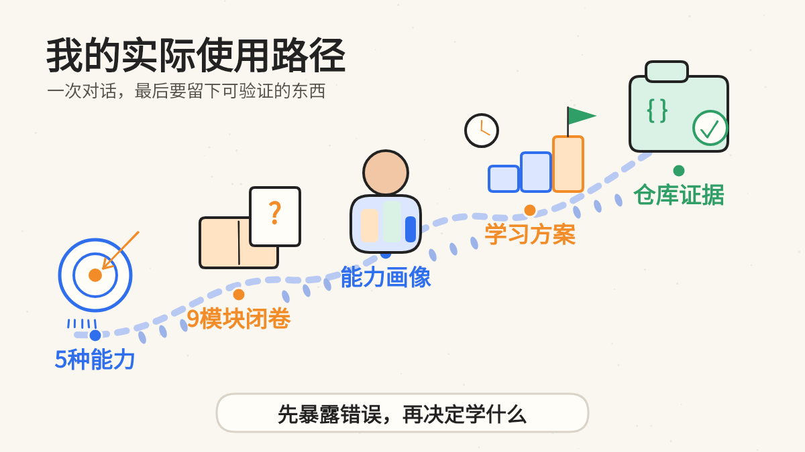
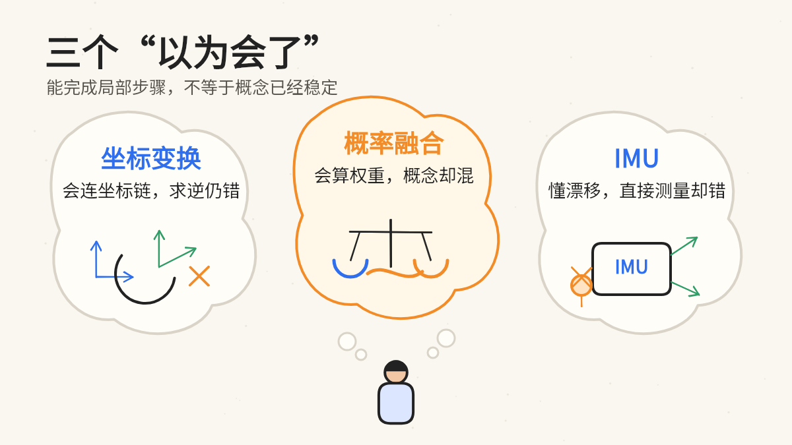
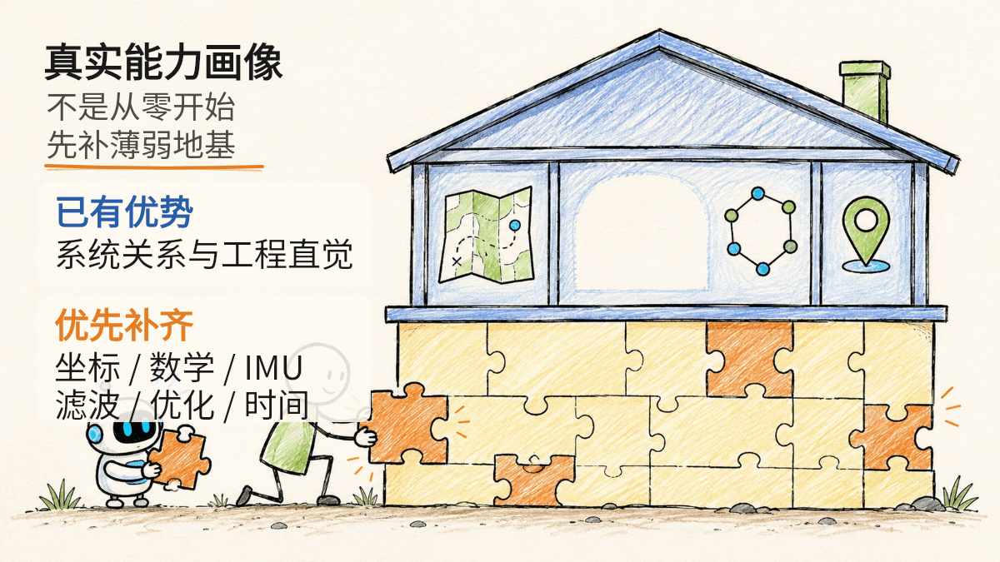

# 我用 ChatGPT 实践“十倍学习法”学习定位建图：第一次诊断复盘

我是自动驾驶感知算法工程师，有深度学习和多传感器工程经验，也接触过定位、SLAM 与重定位。但真正准备系统学习时，我一直无法准确回答：这些知识，我是真正掌握了，还是只是看过、用过？

过去，我通常先让 ChatGPT 解释概念。这一次，我参考 [Rahul 的文章](https://x.com/sairahul1/article/2068250224532050089)，把顺序反了过来：先定义可验证能力，再围绕九个模块进行闭卷诊断，诊断结束后才制定学习计划。

第一道题就暴露了问题：坐标变换链的表达式我写对了，但一追问乘法顺序，我就解释不清；随后还把完整刚体变换的逆误写成了转置。本文记录我是怎样完成诊断的、它暴露了哪些“以为会了”的知识漏洞，以及这些结论怎样变成能力画像、20 小时路线、核心资源和公开学习仓库。


## 我先把“学会定位建图”改成可检查的目标

“学会定位建图”太模糊，我先把目标拆成五种可验证能力：

- 画清系统、坐标系、时间和数据流；
- 解释算法解决的问题，以及输入和输出；
- 理解关键公式中的变量、坐标、单位、假设和误差；
- 运行最小代码，并分析结果与失败原因；
- 根据传感器、场景、算力和精度要求选择方案。

在整个学习过程中，我让 ChatGPT 分别承担学习教练、严格考官和工程评审三种角色；本轮诊断主要启用后两种角色。诊断覆盖九个模块：坐标变换、线性代数、概率估计、传感器、ROS 与系统工程、滤波与优化、里程计、SLAM、重定位。

我原本给诊断设定了这些规则：一次只问一题，我闭卷回答；回答前不给提示，回答后只标出正确、遗漏和错误；诊断结束以前，不正式授课，也不提前生成完整计划。

这些规则的目的，是避免标准答案制造熟悉感，尽量保留当时的能力边界。



## 三个“我以为会了”的瞬间

九个模块里，真正改变我学习顺序的不是分数。最能代表这种变化的是下面三个错误。



### 坐标变换：会连坐标链，求逆仍然会错

ChatGPT 要我把 `base` 坐标系中的点变换到 `map` 坐标系，我写出了：

$$
{}^{\mathrm{map}}\mathbf{p} =
{}^{\mathrm{map}}\mathbf{T}_{\mathrm{odom}}
{}^{\mathrm{odom}}\mathbf{T}_{\mathrm{base}}
{}^{\mathrm{base}}\mathbf{p}
$$

这个结果没有写错。仓库采用列向量，所以右侧变换先作用：先把点从 `base` 表达到 `odom`，再从 `odom` 表达到 `map`。所谓“上下标消掉”只是一种检查方法，不是原因本身。

我真正算错的是齐次变换的逆。旋转矩阵满足：

$$
\mathbf{R}^{-1}=\mathbf{R}^{\mathsf{T}}
$$

但完整刚体变换还包含平移：

$$
\mathbf{T}=
\begin{bmatrix}
\mathbf{R} & \mathbf{t}\\
\mathbf{0}^{\mathsf{T}} & 1
\end{bmatrix}
$$

它的逆为：

$$
\mathbf{T}^{-1}=
\begin{bmatrix}
\mathbf{R}^{\mathsf{T}} & -\mathbf{R}^{\mathsf{T}}\mathbf{t}\\
\mathbf{0}^{\mathsf{T}} & 1
\end{bmatrix}
$$

这个错误说明，我不该急着把精力全部放到更复杂的 SLAM 算法上。坐标约定、复合、求逆和方向检查必须先补稳，因为后面的测量模型、残差和 TF 关系都依赖它们。

### 概率融合：会算权重，概念仍然会混

题目给出先验和观测：

$$
x\sim\mathcal{N}(10,4),\qquad z=12
$$

测量噪声方差为 1，其中 4 表示先验方差。ChatGPT 先问融合结果会更接近 10 还是 12。

我回答“更接近 10”，理由是“正态分布相加后的均值等于均值相加”。这混淆了两件事：随机变量相加，以及获得观测后对同一个状态做条件估计。

测量方差更小，测量更可靠，因此结果应更接近 12。在这个一维直接观测的例子中：

$$
\begin{aligned}
K &= \frac{4}{4+1}=0.8,\\
\hat{x} &= 10+0.8(12-10)=11.6,\\
P &= (1-K)\times 4=0.8
\end{aligned}
$$

有意思的是，继续计算时，我又能正确给出先验和测量的权重：

$$
w_{\mathrm{prior}}=\frac{1}{5},\qquad
w_{\mathrm{measurement}}=\frac{4}{5}
$$

问题不是完全不会算，而是概率模型不稳定：换一种问法，理解就失效。

因此后续练习不能只代公式。我需要先说清状态、测量、条件和噪声，再计算均值与协方差，并用“测量极准”或“测量极差”的极端情况检查答案。

### IMU：知道积分漂移，不等于知道它测了什么

ChatGPT 问“IMU 和轮速计直接测量什么”，我最初把 IMU 说成直接测量车辆姿态，甚至把位置变量 $x$ 和 $y$ 也放了进去。

更准确地说，陀螺仪直接测三轴角速度，加速度计直接测三轴比力；姿态、速度和位置需要经过状态估计、坐标变换、重力处理与积分得到。轮速传感器直接测车轮转速，再用它推算车辆运动。

后续追问又暴露出一串关联问题：静止时，加速度计仍会测到大小约为 $g$ 的比力；姿态有小误差时，重力会被错误投影到水平方向，虚假加速度经过积分形成速度和位置漂移；匀速转弯虽然速度大小不变，方向却在变，因此仍有向心加速度。

后面的转弯问题还暴露出我会混淆向心加速度、坐标方向与乘员感受到的虚拟离心力。在本仓库采用的“右—前—上”约定中，右转角速度沿负 $z$ 轴，向心加速度沿正 $x$ 轴；完整问答保留在原版记录中。

这次错误让我确认：IMU 物理模型不是可以快速跳过的入门知识，而是 VIO、预积分、误差状态和融合故障分析的地基。

## 我得到的不是总分，而是一张不均匀的能力画像



诊断前，我只能说“自己的定位建图基础比较薄弱”。诊断后，这句话变得具体了。

我已有的优势是系统关系和工程直觉：能区分里程计、SLAM、回环和重定位，理解局部连续性与全局修正，也知道融合应依据传感器采样时间，而不是消息到达时间。

需要优先补齐的是线性代数与概率估计、坐标变换、IMU 物理模型、滤波与优化，以及异频数据和时间处理细节。

ChatGPT 给出的模块分数只用于比较相对强弱，不是标准化考试，也不是能力认证。更重要的结论是：我不需要从“什么是 SLAM”开始平均学习所有内容，而应先加固底层，再把它们接回已有的系统知识。

模块评分与主要缺口保存在[第一次诊断报告](../docs/00_learning_system/diagnostic_report.md)中，错误索引作为配套文档保存在同一目录。

## 诊断之后，我才生成学习阶梯、资源和 20 小时路线

这次实践没有停在“你哪里薄弱”的总结上。我让 ChatGPT 根据诊断结果继续生成三类资料。

第一类是五级学习阶梯：

1. **完全新手**：能辨认核心对象和术语；
2. **基本理解**：能解释原理并完成关键手算；
3. **实用使用者**：能连接系统并运行最小示例；
4. **问题解决者**：能复现故障、定位根因并验证修正；
5. **自信的实践者**：能在真实约束下做系统取舍，并提交有指标和失败分析的项目。

这不是五份课程，而是五种能力深度。我的系统关系局部达到第三级，线性代数、概率与 IMU 仍需补稳第一、二级；第五级只能由后续项目持续证明。

第二类是第一轮 20 小时路线，共 10 个两小时单元。前六个分别补坐标变换、刚体位姿、传感器与时间、最小二乘、概率与 Kalman、IMU 与轮速；后四个再连接局部里程计、滤波与因子图、SLAM 全局修正、重定位与系统设计。

20 小时不是“学会全部 SLAM”的承诺。第一轮目标只是补稳第二级、稳定第三级，并开始积累第四级的实验与故障分析证据。每个单元都要留下“诊断—学习—推导—实现—复盘—输出”的证据链，再把核心概念、公式和常见错误压缩成一张知识卡。完整安排见[学习地图](../docs/00_learning_system/learning_map.md)，进度记录保存在同一目录。

第三类是五个核心资源：Strang 的 *Introduction to Linear Algebra*、Barfoot 的 *State Estimation for Robotics*、ROS tf2 与 REP-105、GTSAM 文档、RTAB-Map 文档。它们是遇到问题时查阅的事实锚点，不是要求从头到尾同时通读的书单，也不能被 AI 生成内容替代。资料入口见[阅读清单](../references/reading_list.md)。

## 对话不能停在聊天框里

如果诊断结束后只留下一段聊天记录，这套方法很难持续。因此，我把结果整理进一个公开单体仓库：

**GitHub 仓库：** [XiaoJiNu/localization-mapping-learning](https://github.com/XiaoJiNu/localization-mapping-learning)

- `docs/` 已保存诊断报告、错误索引、学习地图和复习计划，后续用于保存单元笔记、推导与测验；
- `experiments/` 用于保存最小实验和调试过程；
- `src/` 与 `tests/` 用于保存实现及自动验证；
- `references/` 用于保存教材、官方资料和公开项目索引；
- `articles/` 用于保存每个阶段的复盘。

首个[坐标变换链最小实验](../experiments/exp_001_transform_chain/README.md)已经建立并跑通。它只验证一件事：点从 `base` 到 `odom`、再到 `map` 的逐步变换，与先复合两个变换再直接计算，结果在浮点误差内一致。

这不是 ROS 2 TF 实验，也不能证明我已经掌握坐标变换。它的价值在于把一句“我应该懂了”，变成可重复运行的代码、测试结果和调试记录。

按照这套仓库设计，后续每次学习都要依次留下：原始回答、错误类型、能力画像、学习顺序、推导或代码、验证结果和下一次复习计划。

仓库不是资料仓库，而是证据仓库。

## 第一次执行也失控了，所以我改了规则

问题最明显地出现在 IMU 模块。ChatGPT 根据每个错误继续追问，从直接测量量一路扩展到重力、静止输出、转弯和坐标方向。问题都有价值，但诊断逐渐变成正式教学，题量和时间一起失控。

而且，我在刚看完解释后立刻回答下一题，测到的已经不完全是原有能力，还混入了短期记忆。

第二轮我增加了五条约束：

- 每个模块最多一道主问题和一道必要追问，其余进入后续清单；
- 明确区分诊断模式与教学模式，前者只找边界，后者才深入推导和实验；
- AI 的评分只做相对比较，不当成认证；
- 按概念、推理、计算、符号、坐标时间和工程边界给错误分类；
- 重要结论必须用教材、官方文档、代码或实验交叉验证。

我还建立了当天以及第 1、3、7、14、30 天的延迟复习计划。不过它目前只是计划，只有错误不再复发，并能迁移到代码和项目中，才算真正过关。

## 如果你也想试，可以从这段提示词开始

下面是这次实践压缩后的技术主题通用版本。把方括号中的内容替换成自己的主题即可。

```text
你是我的[学习主题]学习教练、严格考官和工程评审。

我的背景是：[已有知识、工作经历和薄弱部分]。
请先把“学会这个主题”改写成 3～5 种可验证能力。

然后先诊断，不要系统授课：
- 先列出不超过 9 个核心诊断模块；
- 按基础模块依次检查，一次只问一道题；
- 我回答前不给提示或答案；
- 我回答后指出正确、遗漏、错误类型和后续学习项；
- 每个模块最多一道主问题和一道必要追问；
- 诊断结束前不要生成完整学习计划。

诊断结束后，请输出：
1. 我的已有优势与关键缺口；
2. 从完全新手到实践者的五级学习阶梯；
3. 每一级的最小过关证据；
4. 第一轮 20 小时学习路线；
5. 五个核心资源及各自用途；
6. 推导、代码、测试和延迟复习的验证方式。

现在只开始第一道诊断题。
```

真正使用时，不要搜索标准答案，也不要只写结论。把推理过程、不确定之处和可能的错误一起保留下来。诊断的价值，正来自这些不完美的原始回答。

## “十倍”仍然只是方法名称

第一次诊断没有让我学会定位建图，也不能证明学习速度提高了十倍。

它真正完成的是：把“我感觉基础薄弱”变成可行动的能力画像，把平均用力改成针对短板取证，并把一次对话沉淀为可以继续验证的学习仓库。

接下来，我会用闭卷正确率、错误复发率、实验完成度，以及知识能否迁移到真实工程问题，检验这套方法究竟有没有提高效率。

我目前得到的结论更朴素：ChatGPT 最有价值的地方，不只是更快生成解释，而是缩短“产生错误—暴露错误—获得反馈—重新验证”的周期。

但主动回忆、数学推导、代码实验和工程验证，仍然必须由学习者自己完成。

如果你也经常“看懂了 AI 的答案，却仍然不会使用”，可以先不要继续让它解释。让它考你一道题，并保留自己的第一份答案。

那份可能并不正确的回答，往往才是真正学习的起点。

> 本文是面向社交平台重新整理的精简版。更完整的原始问答、公式推导和九模块评分见[原版诊断复盘](00_diagnostic_review.md)。
