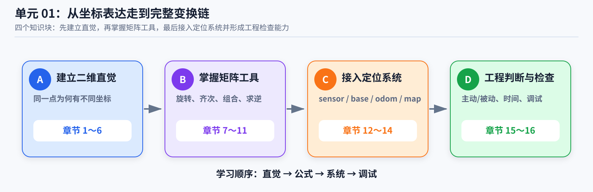
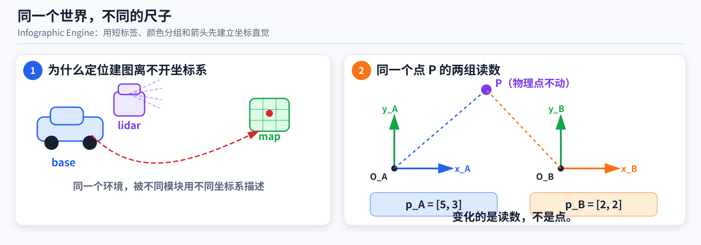
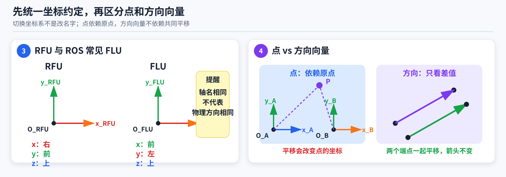
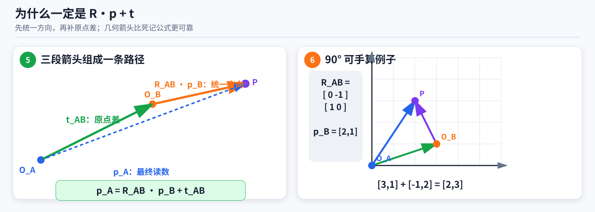
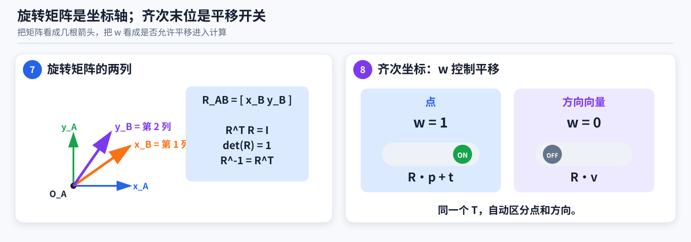
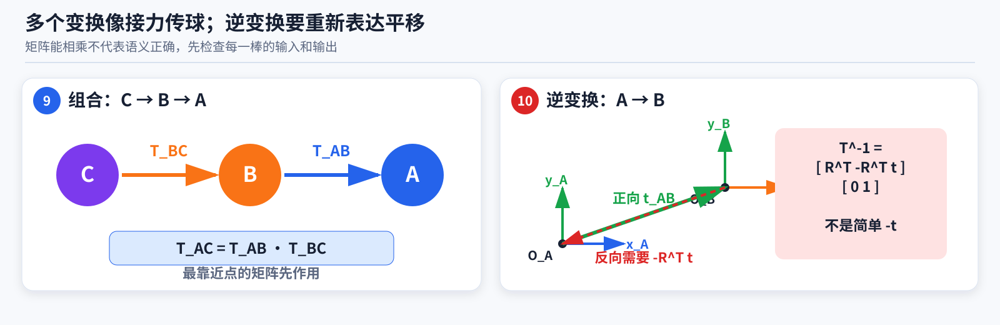
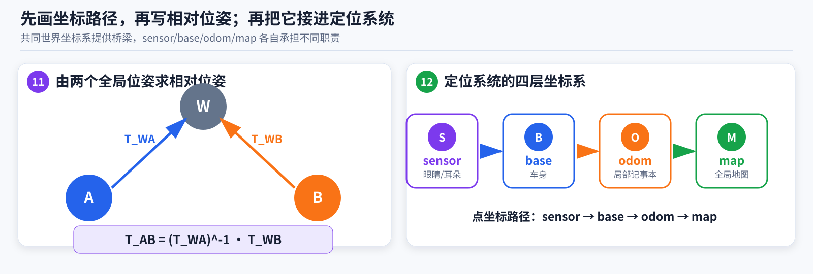
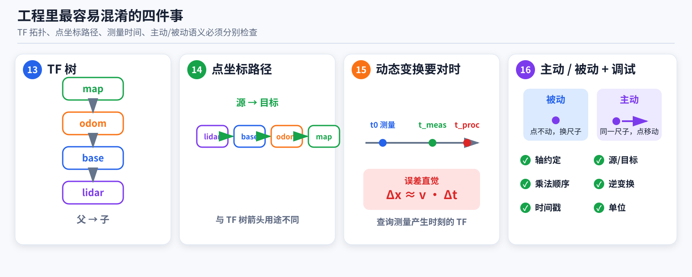

# 连续课程：从坐标表达走到完整变换链

这是单元 01 的主要学习材料。第一次学习时，从第 1 节按顺序读到第 16 节，不需要在每个小节后立刻考试。

> **配图对比版说明：** 本文件保留 `lesson.md` 的课程结构与公式，另用 `awesome-gpt-image-2` 的 **Infographic Engine / 信息图引擎** 思路重新设计配图：每张图只承担少量模块，使用颜色分组、箭头、短标签和留白突出信息流。配图用于建立几何直觉；若图中文字或符号与正文存在差异，以正文公式为准。

## 这篇课程怎样使用

每完成一个知识块，只做三件事：

1. 在自己的[工作簿](workbook.md)中写一句“我现在怎样理解”；
2. 记录一个关键公式、几何关系或工程规则；
3. 写下仍然不明白的问题。

可以随时要求 AI 提供示意图、动画或更小的二维例子。这个阶段可以看课程和提问，不属于闭卷考试。学完整篇、完成练习和实验后，才打开[终测](quiz.md)。

## 课程地图

| 知识块 | 章节 | 要解决的问题 |
|---|---:|---|
| A. 建立二维直觉 | 1～6 | 同一个点为什么会有不同坐标？为什么点变换包含旋转和平移？ |
| B. 掌握矩阵工具 | 7～11 | 旋转矩阵是什么？怎样写齐次矩阵、组合、求逆和相对位姿？ |
| C. 接入定位系统 | 12～14 | `sensor/base/odom/map` 怎样连接？TF 和时间戳怎样理解？ |
| D. 工程判断与检查 | 15～16 | 坐标变换和物体运动有何区别？怎样发现方向、顺序和时间错误？ |

### 课程全景图



> 先看全景图建立结构，再按正文逐节理解。不要依靠图片中的小字代替正文推导。

---

## 1. 为什么定位建图离不开坐标系

激光雷达给出的点最初属于激光雷达坐标系，相机观测属于相机坐标系，里程计估计车体在局部坐标系中的运动，地图则使用全局坐标系。

如果不说明一个数值属于哪个坐标系，`[1, 2, 0]` 没有完整的几何意义。它可能表示：

- 在激光雷达坐标系中，右侧 1 米、前方 2 米；
- 在地图坐标系中，某个全局位置；
- 一个方向向量；
- 一个点的位置。

坐标变换首先是在回答：

> 同一个几何对象，如果改用另一个原点和另一组坐标轴描述，它的数值应是多少？

地图中的墙不会因为坐标数字改变而移动。改变的是描述墙的数字。

## 2. 几何对象、坐标系和坐标表达

一个坐标系至少包含：

- 一个原点；
- 三条有方向的坐标轴；
- 长度和角度单位；
- 轴之间满足的手性约定。

空间中的几何点记作 $P$。同一点在坐标系 $A$ 和坐标系 $B$ 中的两组数值表达分别记作：

$$
{}^{A}\mathbf p,
\qquad
{}^{B}\mathbf p
$$

两组数字可能不同，但描述的是同一个物理点。左上标不是乘方，而是在说明“这组数字使用哪个坐标系表达”。

### 2.1 位置、姿态和位姿

- 位置：原点在哪里，通常用平移向量表示；
- 姿态：坐标轴朝向怎样，常用旋转矩阵、欧拉角或四元数表示；
- 位姿：同时包含位置和姿态。

坐标系 $B$ 相对于坐标系 $A$ 的位姿，也可以作为把点坐标从 $B$ 映射到 $A$ 的变换。

### 2.2 同一个点为什么会有不同数字

假设点 $P$ 没有移动。坐标系 $B$ 的原点比坐标系 $A$ 的原点向右 3 米。

若点 $P$ 在坐标系 $B$ 中的横坐标为 2 米，那么它在坐标系 $A$ 中的横坐标为 5 米。

物理点没有移动，变化的是测量起点。



> 图中车辆、激光雷达、相机、里程计和地图都在描述同一个世界，但每个模块使用自己的坐标系。右侧强调：同一个点 $P$ 不动，坐标数字由所选原点和坐标轴决定。

## 3. 本仓库的坐标约定

本仓库采用：

- $x$ 轴向右；
- $y$ 轴向前；
- $z$ 轴向上；
- 右手系；
- 点使用列向量；
- 变换矩阵左乘点坐标。

这套“右—前—上”约定简称 RFU。

ROS REP-103 常见车体坐标轴为：

- $x$ 轴向前；
- $y$ 轴向左；
- $z$ 轴向上。

它可以简称 FLU。两者都是右手系，但轴名对应的物理方向不同，不能只修改帧名而不转换数值。

同一个方向向量从 RFU 转到 FLU，可以使用：

$$
{}^{\mathrm{FLU}}\mathbf v =
\begin{bmatrix}
0 & 1 & 0\\
-1 & 0 & 0\\
0 & 0 & 1
\end{bmatrix}
{}^{\mathrm{RFU}}\mathbf v
$$

例如，RFU 中的“向右 1 米”为：

$$
\begin{bmatrix}
1\\
0\\
0
\end{bmatrix}
$$

在 FLU 中应写成：

$$
\begin{bmatrix}
0\\
-1\\
0
\end{bmatrix}
$$

接入 ROS、公开数据集或其他代码前，必须先逐轴阅读其坐标定义。

## 4. 点与方向向量为什么不同

点表示空间中的一个位置。点相对于坐标系原点，因此原点变化时，点坐标会受到平移影响。

点的变换为：

$$
{}^{A}\mathbf p =
{}^{A}\mathbf R_B{}^{B}\mathbf p +
{}^{A}\mathbf t_B
$$

其中：

- 旋转矩阵把方向的坐标表达从 $B$ 转换到 $A$；
- 平移向量表示坐标系 $B$ 的原点在坐标系 $A$ 中的位置；
- 输入点是点 $P$ 相对 $O_B$ 的坐标；
- 输出点是同一点 $P$ 相对 $O_A$ 的坐标。

方向向量可以由两个点相减得到。设：

$$
\mathbf v = \mathbf p_2 - \mathbf p_1
$$

两个端点同时平移后：

$$
(\mathbf p_2 + \mathbf t) -
(\mathbf p_1 + \mathbf t) =
\mathbf p_2 - \mathbf p_1
$$

平移相消，所以方向向量只受旋转影响：

$$
{}^{A}\mathbf v =
{}^{A}\mathbf R_B{}^{B}\mathbf v
$$

在齐次坐标中：

- 点的最后一维是 1；
- 方向向量的最后一维是 0。

这使同一个齐次矩阵能够自动区分二者。



> 左侧用于逐轴核对 RFU 与 ROS 常见 FLU；右侧用两幅小图说明点依赖原点，而由两点之差得到的方向向量不受共同平移影响。

## 5. 为什么点变换必然包含旋转和平移

设两个坐标系原点分别为 $O_A$ 和 $O_B$，空间中有一个点 $P$。

纯几何关系为：

$$
\overrightarrow{O_AP} =
\overrightarrow{O_AO_B} +
\overrightarrow{O_BP}
$$

它表示：

```text
从 O_A 到 P
= 从 O_A 到 O_B
+ 从 O_B 到 P
```

第一段向量在坐标系 $A$ 中的表达是平移向量：

$$
{}^{A}\mathbf t_B =
[\overrightarrow{O_AO_B}]_A
$$

输入点坐标表示第二段向量在坐标系 $B$ 中的表达：

$$
{}^{B}\mathbf p =
[\overrightarrow{O_BP}]_B
$$

两个使用不同坐标系表达的数字不能直接相加。必须先把第二段向量改用坐标系 $A$ 表达：

$$
[\overrightarrow{O_BP}]_A =
{}^{A}\mathbf R_B{}^{B}\mathbf p
$$

因此：

$$
{}^{A}\mathbf p =
{}^{A}\mathbf R_B{}^{B}\mathbf p +
{}^{A}\mathbf t_B
$$

这里的“先旋转、再平移”更准确地表示：

1. 先把向量的坐标表达从 $B$ 改为 $A$；
2. 再与同样使用 $A$ 表达的平移向量相加。

点 $P$ 本身没有因此发生物理运动。

## 6. 一个可以手算的二维例子

设：

- 坐标系 $B$ 的原点在 $A$ 中为 `[3, 1]`；
- 坐标系 $B$ 相对 $A$ 逆时针旋转 90 度；
- 点 $P$ 在坐标系 $B$ 中的坐标为 `[2, 1]`。

旋转矩阵和平移为：

$$
{}^{A}\mathbf R_B =
\begin{bmatrix}
0 & -1\\
1 & 0
\end{bmatrix}
$$

$$
{}^{A}\mathbf t_B =
\begin{bmatrix}
3\\
1
\end{bmatrix}
$$

先把从 $O_B$ 到 $P$ 的向量用坐标系 $A$ 表达：

$$
{}^{A}\mathbf R_B{}^{B}\mathbf p =
\begin{bmatrix}
0 & -1\\
1 & 0
\end{bmatrix}
\begin{bmatrix}
2\\
1
\end{bmatrix} =
\begin{bmatrix}
-1\\
2
\end{bmatrix}
$$

这个结果表示：从 $O_B$ 到 $P$，在坐标系 $A$ 看来是向左 1、向上 2。

再加上 $O_B$ 在坐标系 $A$ 中的位置：

$$
{}^{A}\mathbf p =
\begin{bmatrix}
-1\\
2
\end{bmatrix} +
\begin{bmatrix}
3\\
1
\end{bmatrix} =
\begin{bmatrix}
2\\
3
\end{bmatrix}
$$

几何路径为：

```text
O_A --向右 3、向上 1--> O_B
O_B --向左 1、向上 2--> P
O_A --向右 2、向上 3--> P
```



> 左图把公式还原为三段几何箭头；右图将 $[3,1]$、 $[-1,2]$ 和 $[2,3]$ 放在同一张坐标网格中，便于核对方向和终点。

## 7. 旋转矩阵的本质与性质

二维情况下，若坐标系 $B$ 相对 $A$ 逆时针旋转角度 $\theta$，则：

$$
{}^{A}\mathbf R_B =
\begin{bmatrix}
\cos\theta & -\sin\theta\\
\sin\theta & \cos\theta
\end{bmatrix}
$$

它的第一列为：

$$
{}^{A}\mathbf e_{x_B} =
\begin{bmatrix}
\cos\theta\\
\sin\theta
\end{bmatrix}
$$

它表示 $B$ 的 $x_B$ 轴在坐标系 $A$ 中的坐标。

第二列为：

$$
{}^{A}\mathbf e_{y_B} =
\begin{bmatrix}
-\sin\theta\\
\cos\theta
\end{bmatrix}
$$

它表示 $B$ 的 $y_B$ 轴在坐标系 $A$ 中的坐标。

因此，旋转矩阵的核心解释是：

> 每一列都是源坐标系的一条单位轴，在目标坐标系中的坐标。

若输入向量为：

$$
{}^{B}\mathbf p =
\begin{bmatrix}
x_B\\
y_B
\end{bmatrix}
$$

矩阵乘法实际是在做：

$$
{}^{A}\mathbf R_B{}^{B}\mathbf p =
x_B{}^{A}\mathbf e_{x_B} +
y_B{}^{A}\mathbf e_{y_B}
$$

### 7.1 正交性

旋转矩阵的每一列都是单位向量，不同列互相垂直，因此：

$$
\mathbf R^{\mathsf T}\mathbf R = \mathbf I
$$

### 7.2 行列式

纯旋转应满足：

$$
\det(\mathbf R) = 1
$$

若行列式为 -1，通常包含镜像反射，不是纯旋转。

### 7.3 逆等于转置

由正交性可得：

$$
\mathbf R^{-1} = \mathbf R^{\mathsf T}
$$

注意：正交旋转矩阵满足这个性质，任意可逆矩阵不一定满足。

### 7.4 旋转保持什么

旋转不改变：

- 向量长度；
- 两个向量之间的夹角；
- 两点距离；
- 刚体形状。

## 8. 从普通形式到齐次变换

普通点变换为：

$$
{}^{A}\mathbf p =
{}^{A}\mathbf R_B{}^{B}\mathbf p +
{}^{A}\mathbf t_B
$$

为了把旋转和平移合并为一次矩阵乘法，引入齐次坐标。

二维点写成：

$$
{}^{B}\bar{\mathbf p} =
\begin{bmatrix}
x_B\\
y_B\\1
\end{bmatrix}
$$

二维齐次变换为：

$$
{}^{A}\mathbf T_B =
\begin{bmatrix}
{}^{A}\mathbf R_B & {}^{A}\mathbf t_B\\
\mathbf 0^{\mathsf T} & 1
\end{bmatrix}
$$

于是：

$$
{}^{A}\bar{\mathbf p} =
{}^{A}\mathbf T_B{}^{B}\bar{\mathbf p}
$$

三维情况下，齐次变换为 4 × 4 矩阵：

$$
{}^{A}\mathbf T_B =
\begin{bmatrix}
{}^{A}\mathbf R_B & {}^{A}\mathbf t_B\\
\mathbf 0^{\mathsf T} & 1
\end{bmatrix}
$$

三维点和方向向量分别写成：

$$
{}^{B}\bar{\mathbf p} =
\begin{bmatrix}
{}^{B}\mathbf p\\1
\end{bmatrix},
\qquad
{}^{B}\bar{\mathbf v} =
\begin{bmatrix}
{}^{B}\mathbf v\\0
\end{bmatrix}
$$

点变换结果为：

$$
{}^{A}\mathbf T_B{}^{B}\bar{\mathbf p} =
\begin{bmatrix}
{}^{A}\mathbf R_B{}^{B}\mathbf p + {}^{A}\mathbf t_B\\
1
\end{bmatrix}
$$

方向向量变换结果为：

$$
{}^{A}\mathbf T_B{}^{B}\bar{\mathbf v} =
\begin{bmatrix}
{}^{A}\mathbf R_B{}^{B}\mathbf v\\
0
\end{bmatrix}
$$

最后一维为 0 时，平移列不会作用到方向向量。



> 左侧把旋转矩阵的列解释成源坐标系的单位轴；右侧把齐次末位画成开关：点的 $w=1$ 打开平移，方向向量的 $w=0$ 关闭平移。

## 9. 变换为什么按这个顺序组合

已知点先从坐标系 $C$ 映射到 $B$：

$$
{}^{B}\mathbf p =
{}^{B}\mathbf T_C{}^{C}\mathbf p
$$

再从坐标系 $B$ 映射到 $A$：

$$
{}^{A}\mathbf p =
{}^{A}\mathbf T_B{}^{B}\mathbf p
$$

把第一式代入第二式：

$$
{}^{A}\mathbf p =
{}^{A}\mathbf T_B
{}^{B}\mathbf T_C
{}^{C}\mathbf p
$$

所以：

$$
{}^{A}\mathbf T_C =
{}^{A}\mathbf T_B{}^{B}\mathbf T_C
$$

采用列向量和左乘时，最靠近点的矩阵最先作用：

```text
C 中的点
  ↓  C 到 B
B 中的点
  ↓  B 到 A
A 中的点
```

“中间坐标系消去”是一种快速检查方法。真正的原因是前一段的输出坐标系必须等于后一段的输入坐标系。

即使两个错误顺序的 4 × 4 矩阵仍能相乘，数值库通常也不会报错。因此“维度能乘”不等于“坐标语义正确”。

组合后的旋转部分为：

$$
{}^{A}\mathbf R_C =
{}^{A}\mathbf R_B{}^{B}\mathbf R_C
$$

组合后的平移部分为：

$$
{}^{A}\mathbf t_C =
{}^{A}\mathbf R_B{}^{B}\mathbf t_C +
{}^{A}\mathbf t_B
$$

平移部分再次出现“旋转后加平移”，因为第二段平移最初用坐标系 $B$ 表达，必须先改用坐标系 $A$ 表达。

## 10. 齐次刚体变换怎样求逆

正向点变换为：

$$
{}^{A}\mathbf p =
{}^{A}\mathbf R_B{}^{B}\mathbf p +
{}^{A}\mathbf t_B
$$

先移去平移：

$$
{}^{A}\mathbf p - {}^{A}\mathbf t_B =
{}^{A}\mathbf R_B{}^{B}\mathbf p
$$

再左乘旋转的逆：

$$
{}^{B}\mathbf p =
\left({}^{A}\mathbf R_B\right)^{\mathsf T}
\left({}^{A}\mathbf p - {}^{A}\mathbf t_B\right)
$$

因此逆旋转为：

$$
{}^{B}\mathbf R_A =
\left({}^{A}\mathbf R_B\right)^{\mathsf T}
$$

逆平移为：

$$
{}^{B}\mathbf t_A = -
\left({}^{A}\mathbf R_B\right)^{\mathsf T}
{}^{A}\mathbf t_B
$$

完整逆变换为：

$$
{}^{B}\mathbf T_A =
\left({}^{A}\mathbf T_B\right)^{-1} =
\begin{bmatrix}
\left({}^{A}\mathbf R_B\right)^{\mathsf T} &
-\left({}^{A}\mathbf R_B\right)^{\mathsf T}{}^{A}\mathbf t_B\\
\mathbf 0^{\mathsf T} & 1
\end{bmatrix}
$$

逆平移通常不是简单的负平移。改变箭头方向后，还必须把平移向量重新表达在逆变换的目标坐标系中。

完整齐次变换一般不满足“逆等于转置”。

最直接的闭环检查是：

$$
{}^{A}\mathbf T_B{}^{B}\mathbf T_A \approx \mathbf I
$$

也可以把一个点正向变换后再逆向变换，检查是否回到原坐标。



> 组合图强调“最靠近点的变换先作用”；逆变换图强调反向平移不仅要改变方向，还必须重新表达在反向目标坐标系中。

## 11. 根据两个全局位姿求相对位姿

设世界坐标系为 $W$。已知坐标系 $A$ 和 $B$ 在世界坐标系中的位姿，要求坐标系 $B$ 相对于 $A$ 的位姿。

要把点坐标从 $B$ 转到 $A$，坐标路径为：

```text
B → W → A
```

从世界坐标系转到 $A$ 使用 $A$ 在世界中的位姿的逆。因此：

$$
{}^{A}\mathbf T_B =
\left({}^{W}\mathbf T_A\right)^{-1}
{}^{W}\mathbf T_B
$$

### 11.1 两帧车辆位姿求相对运动

已知车辆在时刻 $k$ 和 $k+1$ 的地图位姿，则：

$$
{}^{\mathrm{base}_k}\mathbf T_{\mathrm{base}_{k+1}} =
\left({}^{\mathrm{map}}\mathbf T_{\mathrm{base}_k}\right)^{-1}
{}^{\mathrm{map}}\mathbf T_{\mathrm{base}_{k+1}}
$$

### 11.2 根据共同车体系位姿求传感器相对外参

若相机和激光雷达的位姿都相对于 `base` 给出，则：

$$
{}^{\mathrm{camera}}\mathbf T_{\mathrm{lidar}} =
\left({}^{\mathrm{base}}\mathbf T_{\mathrm{camera}}\right)^{-1}
{}^{\mathrm{base}}\mathbf T_{\mathrm{lidar}}
$$

判断公式时，不要背“谁减谁”，而要画清源到目标的坐标路径。

## 12. 定位系统中的完整坐标链

常见移动机器人定位系统包含：

| 坐标系 | 作用 | 常见性质 |
|---|---|---|
| `sensor` | 传感器产生原始观测的坐标系 | 与 `base` 之间通常是静态外参 |
| `base` | 机器人或车辆的机体坐标系 | 随机器人运动 |
| `odom` | 连续的局部参考系 | 短期平滑，长期可能漂移 |
| `map` | 全局一致参考系 | 全局修正时可相对 `odom` 变化 |

以激光点为例：

$$
{}^{\mathrm{map}}\mathbf p =
{}^{\mathrm{map}}\mathbf T_{\mathrm{odom}}
{}^{\mathrm{odom}}\mathbf T_{\mathrm{base}}
{}^{\mathrm{base}}\mathbf T_{\mathrm{lidar}}
{}^{\mathrm{lidar}}\mathbf p
$$

从右向左执行：

1. `lidar → base`；
2. `base → odom`；
3. `odom → map`。

只需要车体全局位姿时：

$$
{}^{\mathrm{map}}\mathbf T_{\mathrm{base}} =
{}^{\mathrm{map}}\mathbf T_{\mathrm{odom}}
{}^{\mathrm{odom}}\mathbf T_{\mathrm{base}}
$$

如果全局定位给出车体在地图中的位姿，则：

$$
{}^{\mathrm{map}}\mathbf T_{\mathrm{odom}} =
{}^{\mathrm{map}}\mathbf T_{\mathrm{base}}
\left({}^{\mathrm{odom}}\mathbf T_{\mathrm{base}}\right)^{-1}
$$

这样可以保持局部里程计输出连续，把回环、GNSS 或重定位带来的全局修正放入 `map` 与 `odom` 的对齐关系中。



> 左侧先画 $B\rightarrow W\rightarrow A$ 的路径，再写相对位姿；右侧把传感器、车体、局部里程计和全局地图放在同一条系统链中。

## 13. TF 树的边与点坐标映射不是同一种箭头

TF 树常按父帧到子帧画边：

```text
map → odom → base → lidar
```

例如 `base → lidar` 表示 `base` 是父帧，`lidar` 是子帧。子帧在父帧中的位姿对应从 `lidar` 坐标映射到 `base` 坐标的变换。

把激光点变到地图时，点坐标映射路径为：

```text
lidar → base → odom → map
```

两组箭头看起来相反，是因为：

- 前者表示树的父子拓扑；
- 后者表示点坐标从源到目标的计算路径。

不能只看到箭头就猜矩阵方向。最终应写完整点变换等式：

$$
{}^{\mathrm{target}}\mathbf p =
{}^{\mathrm{target}}\mathbf T_{\mathrm{source}}
{}^{\mathrm{source}}\mathbf p
$$

ROS 移动平台中 `map`、`odom` 和 `base_link` 的常见职责可参考 REP-105，tf2 的查询与缓存可参考 ROS 2 官方 tf2 文档。

## 14. 时间戳为什么也是变换条件

静态外参理想情况下不随时间变化，例如激光雷达到车体的安装关系。

车体相对 `odom` 的位姿会随运动变化，应写成时间函数：

$$
{}^{\mathrm{odom}}\mathbf T_{\mathrm{base}}(t)
$$

假设激光帧在 12.0 秒产生，在 12.1 秒才被程序处理。正确做法是查询或插值测量产生时刻 12.0 秒的动态变换，而不是直接使用处理时刻的最新变换。

即使方向和矩阵顺序完全正确，时间不一致仍会产生与线速度、角速度和时间差相关的偏移。

本单元只建立基本规则：

> 动态变换必须与测量时刻一致。

多传感器异频同步和点云帧内运动补偿在后续单元展开。

## 15. 坐标变换与物体真实运动不是一回事

相同的代数形式可能有两种不同语义。

### 15.1 被动变换：物理点不动，换坐标系描述

$$
{}^{A}\mathbf p =
{}^{A}\mathbf T_B{}^{B}\mathbf p
$$

- 输入和输出描述同一个物理点；
- 坐标系发生变化；
- 改变的是坐标数字。

本单元主要讨论这种情况。

### 15.2 主动变换：坐标系不动，物体真的运动

$$
\mathbf p' = \mathbf T\mathbf p
$$

- 坐标系保持不变；
- 输入和输出对应两个不同的物理位置；
- 物体真的发生旋转或平移。

只看矩阵数值无法区分两种语义。必须检查：

- 输入点表达在哪个坐标系；
- 输出点表达在哪个坐标系；
- 物理点是否真的运动；
- 题目使用的是位姿还是运动增量。

不够严谨的说法是“把点旋转到 $A$ 系”。更严谨的说法是：

> 将点或向量的坐标表达从坐标系 $B$ 转换到坐标系 $A$。



> 这张图把工程中最容易混淆的四件事放在一起：TF 树与点坐标路径、测量时刻与处理时刻、被动换坐标系与主动移动物体，以及从坐标约定到时间戳的固定排查顺序。

## 16. 常见错误与固定调试顺序

### 16.1 常见错误

1. 只凭 `T_ab` 变量名猜变换方向；
2. 把不同坐标系表达的数字直接相加；
3. 交换矩阵顺序，因为维度仍能相乘而没有发现；
4. 把完整齐次变换的逆直接写成转置；
5. 把逆平移直接写成负平移；
6. 对方向向量错误地加入平移；
7. 混用行向量和列向量；
8. 混用 RFU 与 FLU；
9. 混用角度和弧度；
10. 使用处理时刻而不是测量时刻的动态 TF；
11. 把坐标表达变化误认为物体真实运动。

### 16.2 固定调试顺序

遇到点云偏移、方向翻转或两条路径不一致时：

1. 写清每个坐标系的原点、轴向、手性和单位；
2. 给每个点、向量和变换标出表达坐标系；
3. 写出完整点变换等式，确认源和目标；
4. 检查相邻坐标系是否正确衔接；
5. 用源坐标系原点测试平移；
6. 用各单位轴测试旋转方向；
7. 检查旋转矩阵的正交性和行列式；
8. 检查变换与逆的乘积是否接近单位矩阵；
9. 比较逐段变换与一次复合变换；
10. 核对单位、角度制和时间戳；
11. 最后才换成真实点云或复杂数据。

简单原点和单位轴比真实点云更容易解释。出现问题时，先退回可手算的二维反例。

## 学完本页以后做什么

现在不要打开终测答案。返回自己的[工作簿](workbook.md)，依次完成：

1. 关键练习与推导；
2. [实验 001](../../../experiments/exp_001_transform_chain/README.md)；
3. 一个参数变化和一个故障注入；
4. [闭卷终测](quiz.md)；
5. 5 分钟费曼输出；
6. 归档并安排延迟复习。

读完课程只是步骤 2 完成。练习、实验和终测结束后，才算完成本单元的第一轮学习。
